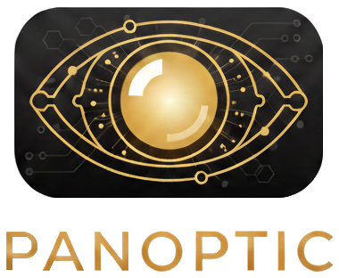

    

Adverse human behaviors detection system using models based on Natural Language Processing, Machine Learning, and Transformers

    
    

---

# Panoptic

Adverse human behaviors detection system using models based on Natural Language Processing, Machine Learning, and Transformers.

---

## License

[MIT](https://choosealicense.com/licenses/mit/)

## Logo

Created with AI.